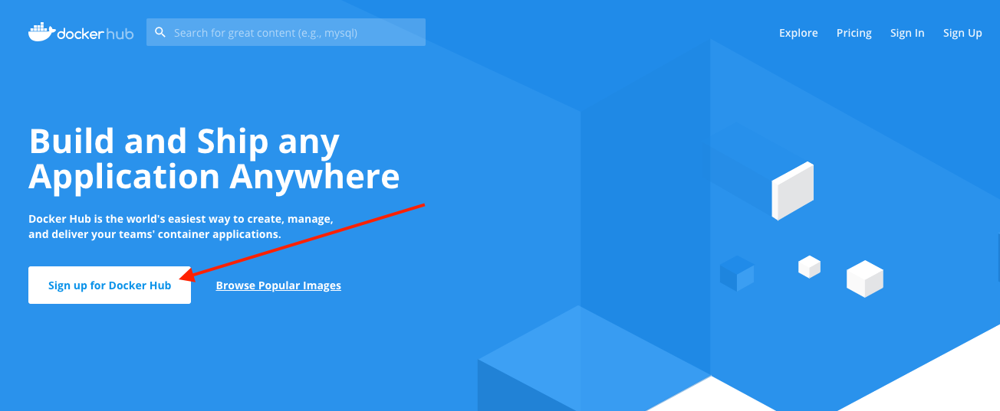
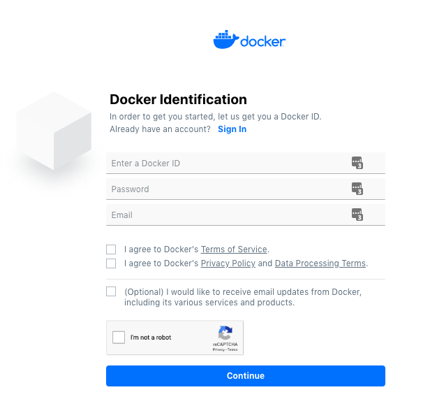
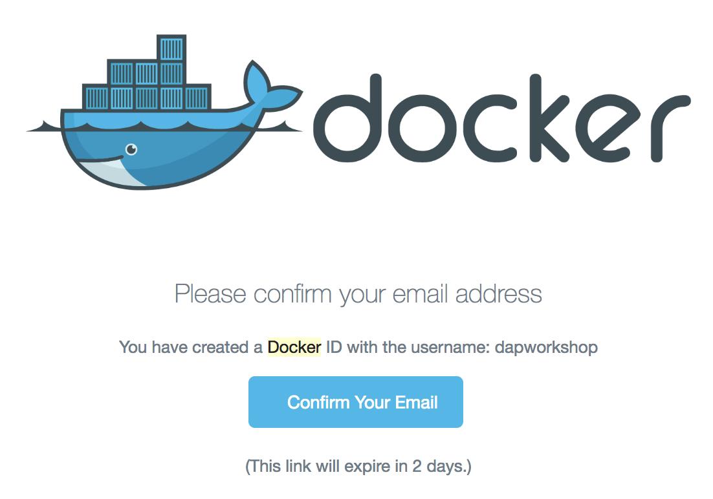
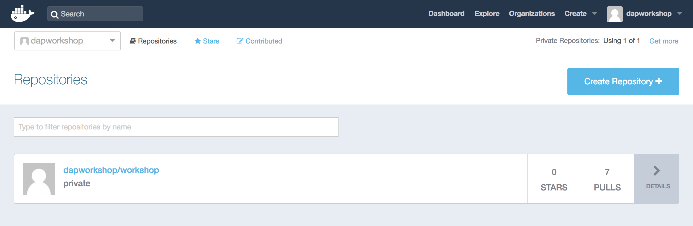
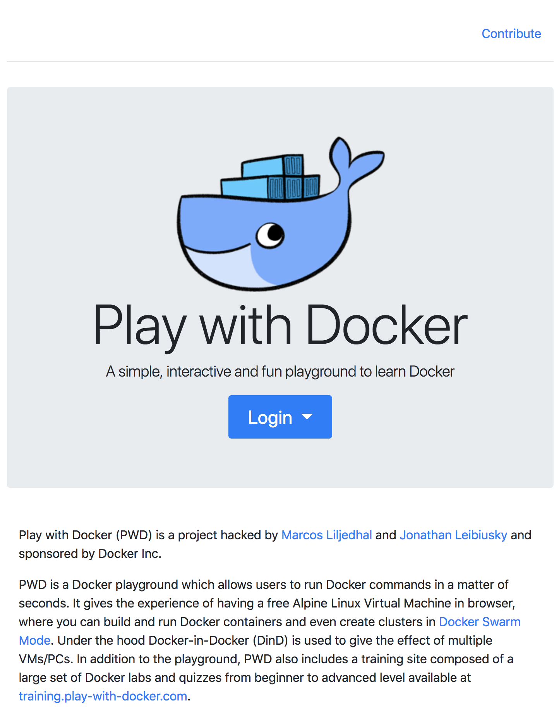
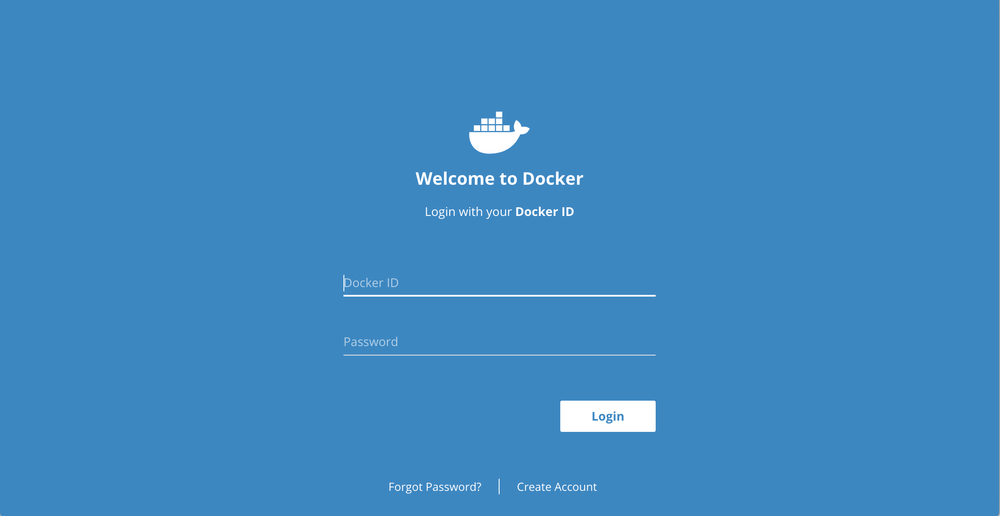
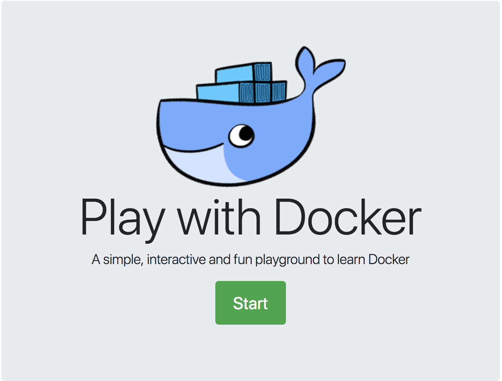
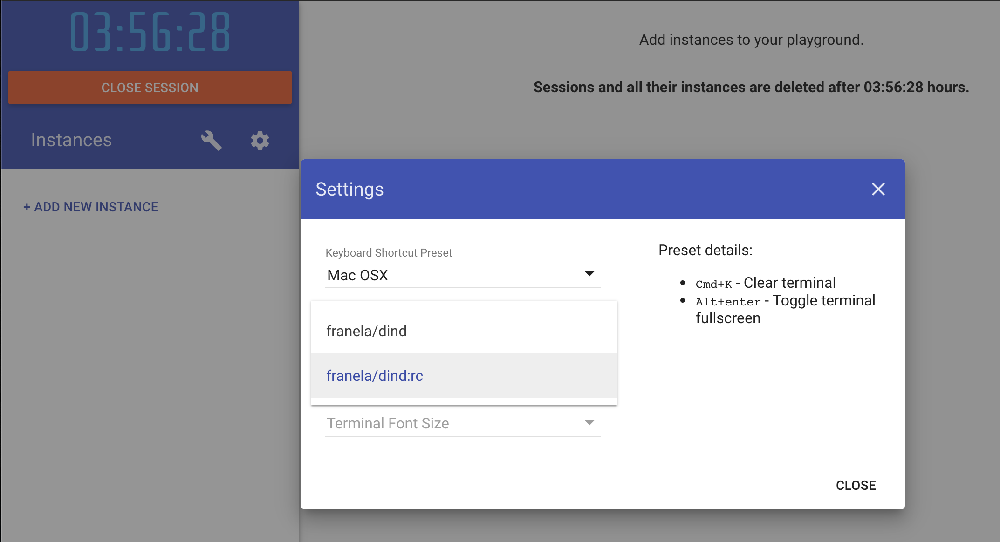
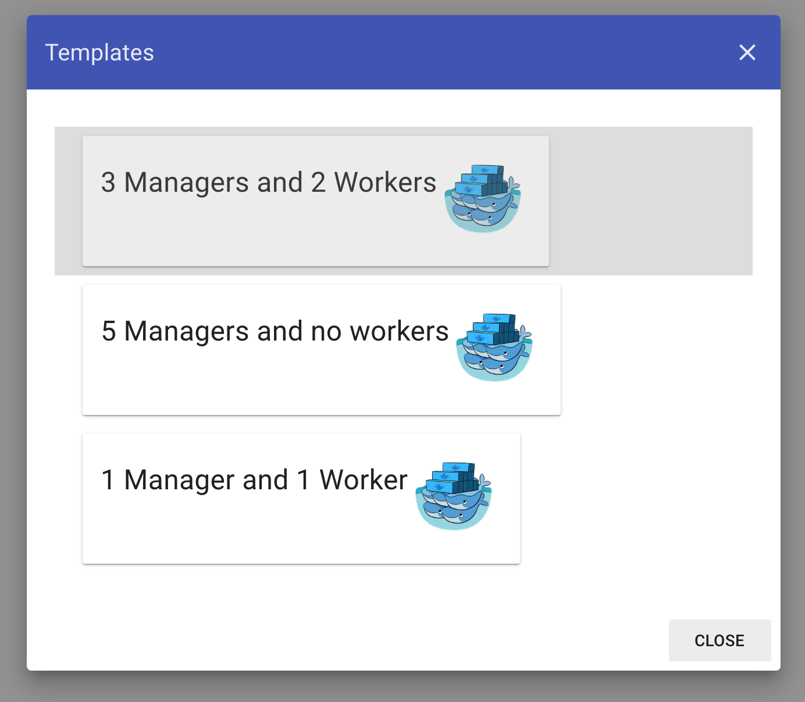

# Set up your environment

> **Time**: Approximately 10 minutes
> **Difficulty**: Easy

## Table of Contents
1. [Create a Docker Hub account](#create-a-docker-hub-account)
1. [Set Up 'Play With Docker'](#set-up-play-with-docker)

## Exercise Objectives

By the end of this exercise you will:

- Have created a Docker Hub account (unless you already have one)
- Learn how to use Play With Docker
- Learn how to install new Docker CLI Plugins

## Create a Docker Hub account

1. If you already have a Docker Hub account, go to **step 5**

2. Go to https://hub.docker.com and click on the "Sign up for Docker Hub" button.

    <details>
      <summary>Details</summary>

    
    </details>

3. Complete the registration form by providing your Docker ID, password, and an email address.

    <details>
      <summary>Details</summary>

    
    </details>

4. Check your mailbox and confirm your email address.

    <details>
      <summary>Details</summary>

    
    </details>

5. Sign in to Docker Hub to validate your credentials work.

    <details>
      <summary>Details</summary>

    https://hub.docker.com

    
    </details>


## Set Up 'Play With Docker'

This workshop will be using [Play With Docker](https://labs.play-with-docker.com) to help everyone have the same experience and reduce our dependency on the conference WiFi to push/pull GBs of images. You can still follow the instructions locally with your own engine.

:warning: **Don't forget to save all of your work on your laptop before leaving the workshop.**

### Getting into Play with Docker

1. Go to https://labs.play-with-docker.com

    <details>
      <summary>Details</summary>

    
    </details>

2. Click on the `Login` dropdown, choose `Docker` and sign in using your `Docker Hub` credentials

    <details>
      <summary>Details</summary>

    
    </details>

3. The `Login` button should turn into a `Start` button. Click the `Start` button to get started!

    <details>
      <summary>Details</summary>

    
    </details>

4. A new session is opened, which will be closed in **4 hours**. You can add multiple new instances and delete them. Each one has it's own engine and own prompt. You can also ssh directly to it if you feel more comfortable with your own terminal.

    :important: Click on the configuration wheel and select **franela/dind:rc** image. This image includes the latest beta release of Docker, which we will be using in this workshop.

    <details>
      <summary>Details</summary>

    
    </details>


### Creating our Instances

For this workshop, we will simulate a basic workflow with two environments:

- A local development environment, represented as a single non-Swarm node
- A remote Swarm cluster

1. Create a swarm cluster by clicking on the wrench (:wrench:) and selecting the `3 Managers and 2 Workers` template. 

    <details>
      <summary>Details</summary>

    
    </details>

    You should see 5 nodes get created named **manager1**, **manager2**, **manager3**, **worker1** and **worker2**.

2. On the **manager1** node, let's demote and remove one worker.

    ```console
    $ docker node rm worker2
    Node worker2 removed from swarm
    ```

3. Click on the **Create Instance** button to add one more instance. This one is _not_ in our Swarm cluster, which we'll use later. 

4. We will be doing most of our work from the **manager1** node, so select it if it's not selected already.

5. Login to Docker Hub using the `docker login` command and your credentials.

    ```console
    $ docker login
    Login with your Docker ID to push and pull images from Docker Hub. If you don't have a Docker ID, head over to https://hub.docker.com to create one.
    Username: dapworkshop
    Password:
    WARNING! Your password will be stored unencrypted in /root/.docker/config.json.
    Configure a credential helper to remove this warning. See
    https://docs.docker.com/engine/reference/commandline/login/#credentials-store

    Login Succeeded
    ```

6. Login on **node1** as well (using `docker login`).


### Installing Docker App

To install Docker App, we will download the latest release from GitHub. Once the Docker 19.03 release is made, Docker App will be included in the Docker Desktop installation.

1. Switch back to **manager1**. All Docker CLI plugins are stored in `~/.docker/cli-plugins`. Let's make that directory first.

    ```console
    $ mkdir -p ~/.docker/cli-plugins
    ```

2. Let's use curl to download the latest release (v0.8.0-rc1) from the [Releases page on GitHub](https://github.com/docker/app/releases). It's a gzipped tarball, so we'll go ahead and automatically untar it in one command.

    ```console
    $ curl -L https://github.com/docker/app/releases/download/v0.8.0-rc1/docker-app-linux.tar.gz | tar zxf -
    ```

3. If you run `ls`, you'll see two binaries. One let's you run Docker App as a standalone library (when you can't use Docker 19.03) and the other is the CLI plugin.

    ```console
    $ ls
    docker-app-plugin-linux      docker-app-standalone-linux
    ```

4. Let's move the `docker-app-plugin-linux` to our CLI plugins directory.

    ```console
    $ mv docker-app-plugin-linux ~/.docker/cli-plugins/docker-app
    ```

5. Validate that it worked by checking the version of the Docker App plugin

    ```console
    $ docker app version
    $ docker app version
    Version:               v0.8.0-rc1
    Git commit:            73d86744
    Built:                 Fri May 24 16:20:19 2019
    OS/Arch:               linux/amd64
    Experimental:          off
    Renderers:             none
    Invocation Base Image: docker/cnab-app-base:v0.8.0-rc1
    ```

6. On the **node1** instance, let's setup Docker App real quick too.

    ```console
    $ mkdir -p ~/.docker/cli-plugins
    $ curl -L https://github.com/docker/app/releases/download/v0.8.0-rc1/docker-app-linux.tar.gz | tar zxf -
    $ mv docker-app-plugin-linux ~/.docker/cli-plugins/docker-app
    ```

**Congratulations** :clap: You just installed yourself your first Docker CLI plugin! And with that, you are ready to [go on to the first exercise](../exercise1)!
